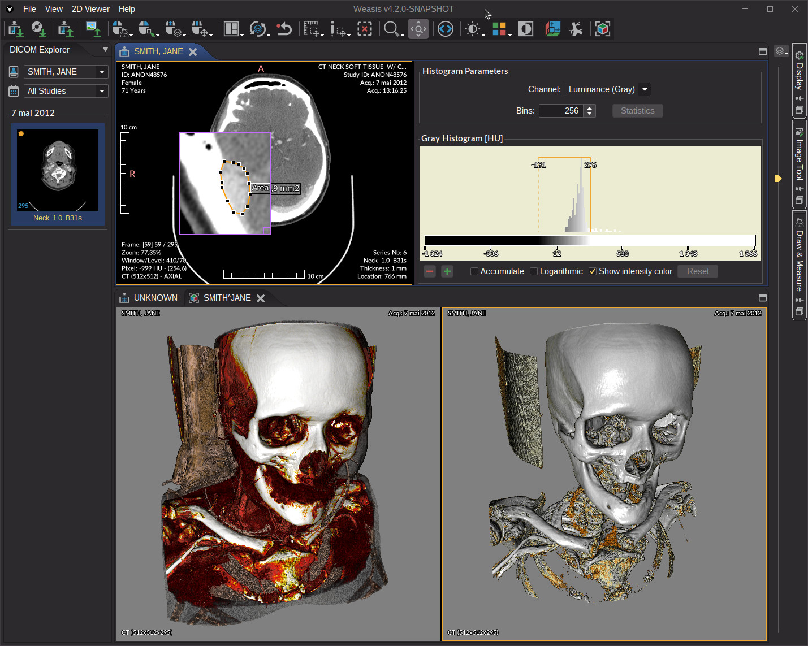

   

    

Weasis is a standalone and web-based software for visualizing images obtained from medical imaging devices. This free DICOM viewer is used in healthcare by hospitals, health networks, multicenter research trials, and patients.

* [General information](https://nroduit.github.io)
* [Download binary releases](https://nroduit.github.io/en/getting-started/download-dicom-viewer)
* [Live Demo with different datasets](https://nroduit.github.io/en/demo)
* [Issues](https://github.com/nroduit/Weasis/issues) ([Old Issue Tracker](https://dcm4che.atlassian.net/projects/WEA))
* Forum: [Google group](https://groups.google.com/forum/#!forum/dcm4che) or [GitHub Discussions](https://github.com/nroduit/Weasis/discussions)

# Release History
See [CHANGELOG](CHANGELOG.md)

# Build Weasis
See [How to build Weasis](https://nroduit.github.io/en/getting-started/building-weasis)

# General Features
* Open source DICOM viewer under EPL 2 or Apache 2 license
* Flexible integration with PACS, VNA, RIS, HIS, or PHR  (see [integration documentation](https://nroduit.github.io/en/basics/customize/integration/))
* [Desktop distributions](https://nroduit.github.io/en/getting-started/download-dicom-viewer/) (Windows, macOS, and Linux)
* Web access through [weasis protocol](https://nroduit.github.io/en/getting-started/weasis-protocol)
* [Responsive user interface](https://nroduit.github.io/en/tutorials/theme/index.html#how-to-scale-the-user-interface) working well on high DPI screens
* [Multi-language support](https://nroduit.github.io/en/getting-started/translating/)
* [Configuration of preferences](https://nroduit.github.io/en/basics/customize/preferences/) on server-side and client-side
* [API for building custom plug-ins](https://nroduit.github.io/en/basics/customize/build-plugins/)
* DICOM Send (storeSCU and STOW-RS)
* [DICOM Query/Retrieve](https://nroduit.github.io/en/tutorials/dicom-import/index.html#dicom-queryretrieve) (C-GET, C-MOVE and WADO-URI) and [DICOMWeb](https://nroduit.github.io/en/tutorials/dicomweb-config) (QUERY and RETRIEVE)
* Dicomizer module to convert standard images into DICOM files
* [Embedded DICOM viewer in CD/DVD](https://nroduit.github.io/en/tutorials/dicom-export/index.html#cddvd-image) or other portable media

# Viewer Features (see also [Tutorials](https://nroduit.github.io/en/tutorials/))

* Data type support
  * Display most DICOM files including multi-frame, enhanced, MPEG-2, MPEG-4, MIME Encapsulation, DOC, SR, PR, KOS, SEG, AU, RT, and ECG
  * Display DICOM image containing float or double data (Parametric Map)
  * Import and export DICOM CD/DVD with DICOMDIR
  * Import and export DICOM ZIP files
  * Viewer for common image formats (TIFF, BMP, GIF, JPEG, PNG, RAS, HDR, and PNM)

* Exporting data
  * Export DICOM files locally with several options (DICOMDIR, ZIP, ISO image file with Weasis, TIFF, JPEG, PNG...)
  * Send DICOM files to a remote PACS or DICOMWeb server (C-STORE or STOW-RS)
  * Save measurements and annotations in DICOM Presentation States or XML file

* Viewing and image rendering
  * Support of several screens with different calibration, support of HiDPI (High Dots Per Inch) monitors, full-screen mode
  * Image manipulation with mouse buttons  (pan, zoom, windowing, rotation, scroll, crosshair)
  * Support of DICOM Modality LUTs, VOI LUTs, LUT Shapes, and Presentation LUTs (even non-linear)
  * Apply DICOM Presentation States (GSPS) and display graphics as overlays
  * Support DICOM Overlays, Shutters, and DICOM Pixel Padding
  * Volume rendering with 3D presets
  * Layouts for comparing series or studies
  * Advanced series synchronization options
  * Display cross-lines
  * Orthogonal Multi-planar Reconstruction (MPR) and 3D cursor
  * Maximum Intensity Projection
  * Persistent magnifier glass

* Measurement and annotation tools
  * Length, area, and angle measurement
  * Region statistics of pixels (Min, Max, Mean, StDev, Skewness, Kurtosis, Entropy)
  * Histogram of modality values
  * SUV measurement

* Specific viewers
  * DICOM ECG: display all the DICOM waveforms and allow to make some measurements
  * DICOM SR: structured report viewer with hyperlinks to images and associated graphics
  * DICOM AU: audio player (allow to export to WAV files)

* Other tools
  * Printing views to DICOM and system printers
  * Apply and Create DICOM Key Object Selection by selecting images with the star button
  * Display and search into all DICOM attributes
  * DICOM RT tools for radiotherapy: display RT structure set, dose, and DVH chart

