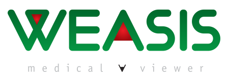

      
       

Weasis is a free medical DICOM viewer used in healthcare by hospitals, health networks, multicenter research trials, and patients.

* [General information](https://nroduit.github.io)
* [Download binary releases](https://nroduit.github.io/en/getting-started/download)
* [Live Demo with different datasets](https://nroduit.github.io/en/demo)
* [Issues](https://github.com/nroduit/Weasis/issues) ([Old Issue Tracker](https://dcm4che.atlassian.net/projects/WEA))
* Forum: [Google group](https://groups.google.com/forum/#!forum/dcm4che) or [GitHub Discussions](https://github.com/nroduit/Weasis/discussions)

:warning: **Security**: Weasis is not affected by CVE-2021-44228 as it does not use log4j but a simple OSGI logger.

# Release History
See [CHANGELOG](CHANGELOG.md)

# Build Weasis

The master branch contains Weasis 4.x.x which requires Java 17+.

See [How to build Weasis](https://nroduit.github.io/en/getting-started/building-weasis)

Old branches are:
* 3.8.x (Java 8+)
* 2.5.x (Java 8+)
* 2.0.x (Java 6+) 
* 1.2.x (Java 6+)

# General Features
* Flexible integration to HIS or PHR (see [integration documentation](https://nroduit.github.io/en/basics/customize/integration/))
* Desktop distribution (Windows, Mac OS X, and Linux)
* Responsive user interface and work well on high DPI screens
* Web access through [weasis protocol](https://nroduit.github.io/en/getting-started/weasis-protocol)
* [Multi-language support](https://nroduit.github.io/en/getting-started/translating/)
* [Configuration of preferences](https://nroduit.github.io/en/basics/customize/preferences/) on server-side and client-side
* [API for building custom plug-ins](https://nroduit.github.io/en/basics/customize/build-plugins/)
* DICOM Send (storeSCU and STOW-RS)
* DICOM Query/Retrieve (C-GET, C-MOVE and WADO-URI) and DICOMWeb (QUERY and RETRIEVE)
* Dicomizer module to convert standard images into DICOM
* Embedded DICOM viewer in CD/DVD or other portable media

# Viewer Features

* Display all kinds of DICOM files (including multi-frame, enhanced, MPEG-2, MPEG-4, MIME Encapsulation, SR, PR, KOS, AU, RT and ECG)
* Viewer for common image formats (TIFF, BMP, GIF, JPEG, PNG, RAS, HDR, and PNM)
* Image manipulation (pan, zoom, windowing, presets, rotation, flip, scroll, crosshair, filtering...)
* Layouts for comparing series or studies
* Advanced series synchronization options
* Display Presentation States (GSPS) and Key Object Selection
* Create key images (Key Object Selection object) by selection
* Support of Modality LUTs, VOI LUTs, and Presentation LUTs (even non-linear)
* Support of several screens with different calibration, support of HiDPI (High Dots Per Inch) monitors, full-screen mode
* Multiplanar reconstructions and Maximum Intensity Projection
* Display Structured Reports
* Display and search into all DICOM attributes
* Display cross-lines
* Measurement and annotation tools
* Region statistics of pixels (Min, Max, Mean, StDev, Skewness, Kurtosis, Entropy)
* Histogram of modality values
* SUV measurement
* Save measurements and annotations in DICOM PR or XML file
* Import CD/DVD and local DICOM files
* Export DICOM with several options (DICOMDIR, ZIP, ISO image file with Weasis, TIFF, JPEG, PNG...)
* Magnifier glass
* Native and DICOM printing
* Read DICOM image containing float or double data (Parametric Map)
* DICOM ECG Viewer
