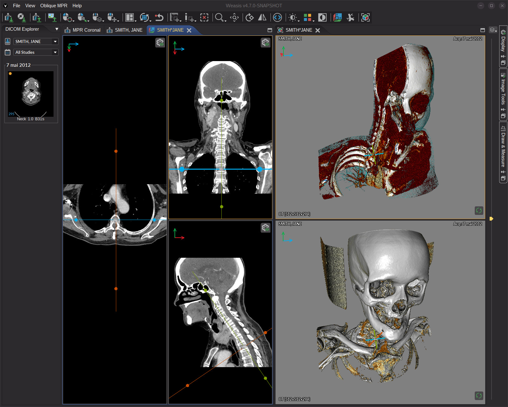

   

    

## Table of Contents
- [About Weasis](#about-weasis)
- [Getting Started](#getting-started)
- [Release History](#release-history)
- [Build Weasis](#build-weasis)
- [General Features](#general-features)
- [Connectivity & Interoperability](#connectivity--interoperability)
- [Viewer Features](#viewer-features-see-also-tutorials)
- [Security & Quality](#security--quality)
- [Community and Support](#community-and-support)
- [License](#license)

## About Weasis

**Weasis** is a powerful, multifunctional, and open-source DICOM viewer designed for both standalone and web-based use. It excels in medical image visualization and is widely used by healthcare professionals and research institutions. Engineered for seamless integration with PACS and DICOM workflows, Weasis offers a reliable solution for modern medical imaging needs — from routine reading to AI-assisted review and quantitative imaging.

.

## Getting Started
* [General information](https://nroduit.github.io)
* [Getting Started](https://nroduit.github.io/en/getting-started)
* [Download binary releases](https://nroduit.github.io/en/getting-started/download-dicom-viewer)
* [Live Demo with different datasets](https://nroduit.github.io/en/demo)

## Release History
See [CHANGELOG](CHANGELOG.md)

## Build Weasis
See [How to build Weasis](https://nroduit.github.io/en/getting-started/building-weasis)

## General Features
* Open source DICOM viewer under EPL 2 or Apache 2 license
* Flexible integration with PACS, VNA, RIS, HIS, or EHR  (see [integration documentation](https://nroduit.github.io/en/basics/customize/integration/))
* [Desktop distributions](https://nroduit.github.io/en/getting-started/download-dicom-viewer/) (Windows, macOS, and Linux)
* Web access through the [weasis protocol](https://nroduit.github.io/en/getting-started/weasis-protocol)
* [Responsive user interface](https://nroduit.github.io/en/tutorials/theme/index.html#how-to-scale-the-user-interface) working well on high-DPI screens
* [Multi-language support](https://nroduit.github.io/en/getting-started/translating/) (20+ languages)
* [Configuration of preferences](https://nroduit.github.io/en/basics/customize/preferences/) on server-side and client-side, multi-level overrides (default → workstation → user)
* [API for building custom plug-ins](https://nroduit.github.io/en/basics/customize/build-plugins/) via the Weasis plug-in archetype
* [Embedded DICOM viewer in CD/DVD](https://nroduit.github.io/en/tutorials/dicom-export/index.html#cddvd-image) or other portable media
* Dicomizer module to convert standard images, videos, PDFs and STL meshes into DICOM files
* [AI-assisted and quantitative imaging workflows](https://weasis.org/en/tutorials/dicom-artificial-intelligence/)

## Connectivity & Interoperability
Weasis supports every common DICOM transport and authentication standard, fitting into existing clinical infrastructure — PACS, VNA, EHR, RIS, and HIS — in two complementary ways:

* **Server-side, via a gateway** such as [ViewerHub](https://weasis.org/en/viewer-hub/) — recommended for clean, centralized integration: the gateway brokers PACS / DICOMweb access, handles authentication and manifest generation, and exposes a single endpoint to the viewer.
* **Client-side**, by configuring **DICOM nodes and DICOMweb sources** directly in Weasis — useful for standalone workstations, smaller sites, or when no gateway is available.
* **Classic DIMSE** — Query/Retrieve (C-FIND, C-GET, C-MOVE) and Store (C-STORE).
* **DICOMweb** — [QIDO-RS, WADO-RS and STOW-RS](https://nroduit.github.io/en/tutorials/dicomweb-config) over HTTPS, configurable per source.
* **WADO-URI** — for legacy PACS servers and the [Weasis manifest](https://nroduit.github.io/en/tutorials/dicom-import/index.html#wado) flow.
* **`weasis://` protocol** — single-click launch from browsers, EHR and RIS portals.
* **Authentication** — Basic auth, OAuth 2.0 and **OpenID Connect** (Authorization Code with PKCE and loopback redirect, RFC 8252) — works against Keycloak, Google Cloud Healthcare and any compliant OIDC provider.
* **Send / Export** — store to a PACS or DICOMweb server (C-STORE or STOW-RS), or export locally as DICOMDIR ZIP, ISO with the Weasis CD viewer embedded, JPEG, PNG, TIFF, AVI / MP4.
* **Integration hooks** — argument-driven launch, manifest-based study loading, downloadable manifests with WADO; documented contracts for EHR / RIS / HIS integration.

## Viewer Features (see also [Tutorials](https://nroduit.github.io/en/tutorials/))

* **Data type support**
  * Display every common DICOM file including multi-frame, **Enhanced** (CT / MR / US Volume), MPEG-2, MPEG-4, MIME Encapsulation, DOC, **SR**, **PR**, **KOS**, **SEG**, AU, **RT**, **ECG** and **Parametric Map** (float / double pixels)
  * Modern codecs: JPEG (baseline, extended, lossless), JPEG-LS, JPEG 2000, **JPEG-XL**, RLE, Deflated Explicit VR Little Endian
  * Import and export DICOM CD/DVD with DICOMDIR
  * Import and export DICOM ZIP files
  * Viewer for common image formats (TIFF, BMP, GIF, JPEG, PNG, RAS, HDR, PNM)

* **Exporting data**
  * Export DICOM files locally with several options (DICOMDIR, ZIP, ISO image with Weasis embedded, TIFF, JPEG, PNG…)
  * Send DICOM files to a remote PACS or DICOMweb server (C-STORE or STOW-RS)
  * Save measurements and annotations as DICOM Presentation States or XML

* **Viewing and image rendering**
  * Multi-monitor support with **per-monitor calibration**, HiDPI, full-screen mode
  * Image manipulation with mouse buttons (pan, zoom, windowing, rotation, scroll, crosshair) and **customizable keyboard shortcuts**
  * DICOM Modality LUTs, VOI LUTs, LUT Shapes, and Presentation LUTs (including non-linear)
  * DICOM Presentation States (GSPS) — applied with graphics rendered as overlays
  * DICOM Overlays, Shutters and Pixel Padding
  * **Lossy compression indicator** in the information layer so the user knows the source quality, messages when geometry issues are detected (inconsistent pixel spacing, slice spacing, or orientation across the series)
  * **Per-view synchronization** with explicit overrides and **FrameOfReferenceUID-aware** grouping (orphan views are excluded from auto-sync to prevent comparing unrelated anatomy)

* **Advanced imaging**
  * **Oblique Multi-Planar Reconstruction (MPR)** with **gantry-tilt correction** (backward mapping + trilinear interpolation) and 3D matrix transformations for non-standard patient positioning
  * **Maximum Intensity Projection (MIP)**
  * **3D Volume Rendering** with presets and **segmentation overlay**
  * **4D / multi-phase series**: automatic dialog to split a multi-phase series into per-phase sub-series for MPR, MIP and VR
  * Cross-lines, 3D cursor 
  * Persistent magnifier glass
  * Layouts for comparing series, studies or modalities side-by-side

* **Measurement and annotation tools**
  * Length, area, angle (incl. Cobb), perpendicular, parallel and free-shape
  * Region statistics of pixels (Min, Max, Mean, StDev, Skewness, Kurtosis, Entropy)
  * Histogram of modality values
  * SUV measurement (PET / nuclear medicine)
  * Pixel-info inspector (raw value, modality value, presentation value)

* **Specific viewers**
  * **DICOM ECG**: display all the DICOM waveforms and allow measurements
  * **DICOM SR**: structured report viewer with hyperlinks to images and associated graphics
  * **DICOM AU**: audio player (allow to export to WAV files)
  * **DICOM RT**: structure-set, dose distribution and DVH viewer

* **Other tools**
  * Printing views to DICOM and system printers
  * Apply and Create DICOM Key Object Selection by selecting images with the star button
  * Display and search across all DICOM attributes
  * **Acquire / Dicomizer**: capture or import non-DICOM media (images, videos, PDFs, STL meshes) and convert into DICOM, with video size validation and per-modality presets

## Security & Quality

* **Authentication & transport** — OAuth 2.0 / OpenID Connect for resource-server access; HTTPS for transport; code-signed installers.
* **Supply chain** — SBOM-tracked dependencies, continuous CVE monitoring.
* **Test coverage** — unit and integration tests pin the most sensitive parts (DICOM decoding, identity model, pixel/LUT pipeline, measurement statistics, anonymisation, authentication, view synchronisation).
* **Static analysis** — every build is scanned by [SonarCloud](https://sonarcloud.io/dashboard?id=org.weasis%3Aweasis-framework) for reliability, maintainability and security ratings, with quality-gate status enforced on the main branch (see badges at the top).
* **Upstream libraries** — [`weasis-core-img`](https://github.com/nroduit/weasis-core-img) and [`weasis-dicom-tools`](https://github.com/nroduit/weasis-dicom-tools) maintain their own ISO 14971-style risk-coverage matrices, cited from this repository's verification index.

## Community and Support
Weasis encourages community participation. Whether you're reporting bugs, suggesting features, or seeking help, you can connect with others here:
* [GitHub Issues](https://github.com/nroduit/Weasis/issues)
* Forum: [Google group](https://groups.google.com/forum/#!forum/dcm4che) or [GitHub Discussions](https://github.com/nroduit/Weasis/discussions)
* [Frequently Asked Questions](https://nroduit.github.io/en/faq/)
* [Contributing guide](CONTRIBUTING.md)

## License
Weasis is dual-licensed under the [EPL 2.0](https://opensource.org/licenses/EPL-2.0) and [Apache 2.0](https://opensource.org/licenses/Apache-2.0).
